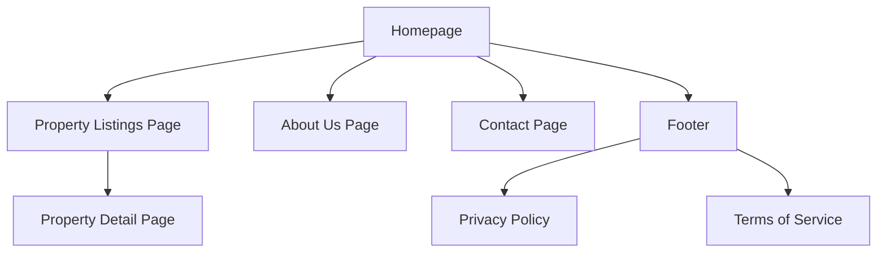
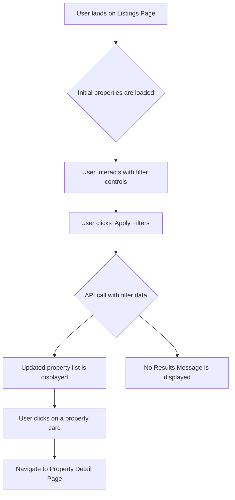
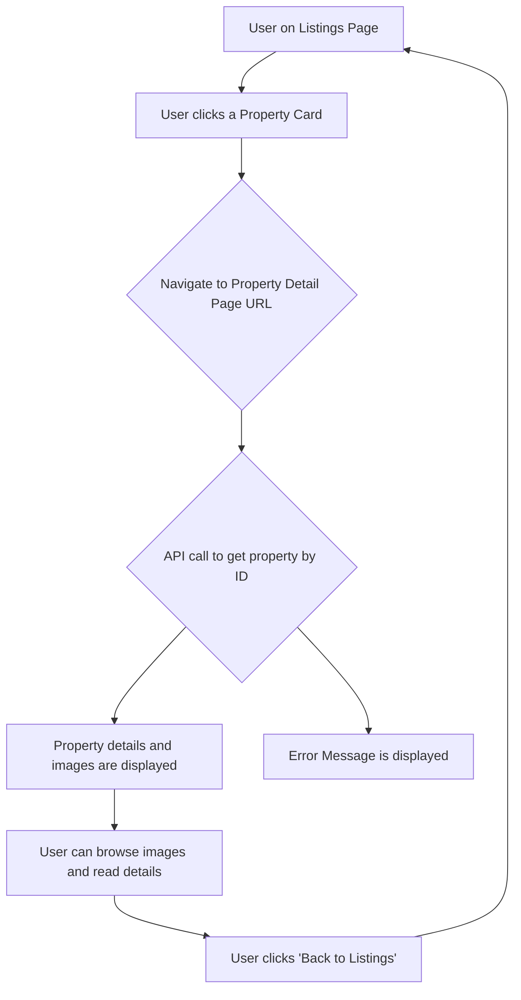

# UI/UX Specification: Real Estate Portal

## Introduction

This document defines the user experience goals, information architecture, user flows, and visual design specifications for the Real Estate Portal. It serves as the foundation for visual design and frontend development, ensuring a cohesive and user-centered experience that feels exclusive and luxurious.

### Overall UX Goals & Principles

To ensure we build a product that resonates with high-value property buyers, we will be guided by the following personas, goals, and principles.

#### Target User Personas

- **"The Investor" (Isabella)**: A seasoned, data-driven professional looking for valuable properties. She values efficiency, clear data presentation, and quick access to key financial metrics. Her time is valuable, and the interface must be a tool, not a distraction.
- **"The Dream Home Seeker" (David)**: A high-net-worth individual searching for a primary residence. He is driven by aesthetics, lifestyle, and emotion. He wants to be captivated by stunning visuals and imagine himself in the space.

#### Usability Goals

- **Effortless Discovery**: Users should be able to find relevant properties with minimal effort. The interface should feel like a concierge service, anticipating their needs.
- **Perceived Prestige**: Every interaction, from the fonts to the animations, should feel premium, reinforcing the high value of the properties.
- **Absolute Clarity**: Information must be presented clearly and concisely. There should be no ambiguity, especially regarding property details and pricing.

#### Design Principles

1.  **Elegance in Simplicity**: A minimalist "less is more" approach. We will use generous white space and a clean layout to let the high-quality property photos be the heroes.
2.  **Visuals First**: The design will prioritize large, immersive imagery and high-resolution video to create an emotional connection.
3.  **Seamless Flow**: Transitions between pages and views should be smooth and subtle, ensuring the user's journey through the site is never interrupted or jarring.

---

## Information Architecture (IA)

This section outlines the structure of the application, ensuring that content is organized logically and is easy for our high-end users to navigate.

### Site Map / Screen Inventory

This diagram shows the overall structure and the primary pages of the application.

### **Navigation Structure**

The navigation is designed to be minimalist and intuitive, aligning with the luxury aesthetic.

- **Primary Navigation (Header)**: The main header will be clean and simple, containing only the most essential links:
  - Logo (links to Homepage)
  - Listings
  - About Us
  - Contact
- **Secondary Navigation (Footer)**: The footer will contain secondary links, such as:
  - Privacy Policy
  - Terms of Service
  - Social Media Links
- **Breadcrumb Strategy**: Breadcrumbs will be used on the Property Detail Page to help users understand their location and easily navigate back to the listings.
  - _Example_: `Home > Listings > [Property Name]`

---

## **User Flows**

### **Browsing and Filtering Properties**

- **User Goal**: To efficiently browse available properties and narrow down the list to find listings that match their specific criteria (price, location, etc.).
- **Entry Points**: Homepage, direct link to the listings page.
- **Success Criteria**: The user successfully applies filters and finds at least one property they are interested in viewing in more detail.

#### **Flow Diagram**

#### **Edge Cases & Error Handling:**

- **No Results**: If a user's filter combination yields no results, a clear and friendly message should be displayed, suggesting they broaden their search criteria.
- **API Failure**: If the initial property list or the filtered list fails to load, a professional error message should appear, with an option to "Try Again."

### **Viewing Property Details**

- **User Goal**: To dive deeper into a specific property that has caught their interest, accessing all available information and imagery in an immersive and easy-to-digest format.
- **Entry Points**: Clicking on a `PropertyCard` from the Property Listings Page.
- **Success Criteria**: The user spends time on the page interacting with the content (e.g., viewing all photos, reading the description) and feels they have a comprehensive understanding of the property.

#### **Flow Diagram**

#### **Edge Cases & Error Handling:**

- **Invalid Property ID**: If the user navigates to a URL with an ID that doesn't exist, a "Property Not Found" page should be displayed with a link back to the main listings page.
- **API Failure**: If the details for a specific property fail to load, a professional error message should appear with an option to "Try Again" or "Return to Listings."

---

## **Wireframes & Mockups**

This section provides low-fidelity layouts for our key screens. While the final, polished visual designs will be created in a dedicated tool like **Figma**, these wireframes serve as a blueprint for the structure and placement of elements.

- **Primary Design Files**: `[Link to Figma/Sketch Project - To Be Created]`

### **Key Screen Layouts**

#### **Property Listings Page**

- **Purpose**: To allow users to easily browse and filter properties.
- **Key Elements**:
  - **Header**: Contains the primary navigation and logo.
  - **Page Title**: A large, elegant title, e.g., "Exclusive Properties".
  - **Filter Bar**: A prominent horizontal bar below the title containing the filter controls (Name, Address, Price Range) and the "Apply Filters" button.
  - **Results Count**: A small text element showing the number of properties found, e.g., "Showing 12 properties".
  - **Property Grid**: The main content area, displaying the `PropertyCard` components in a responsive grid.

#### **Property Detail Page**

- **Purpose**: To provide an immersive, comprehensive view of a single property.
- **Key Elements**:
  - **Header**: Same as above.
  - **Breadcrumb Navigation**: e.g., `Home > Listings > [Property Name]`.
  - **Image Gallery**: A large, hero section at the top of the page showcasing high-resolution photos of the property.
  - **Primary Details Section**: Below the gallery, containing the most critical information in a clean, highly-readable format:
    - Property Name (large title)
    - Address
    - Price (prominently displayed)
  - **Detailed Description Section**: A multi-column layout with further details, such as a long-form description, property specifications (year, code), and owner information.
  - **Call to Action**: A clear "Contact Agent" or "Inquire" button.

---

## **Component Library / Design System**

To ensure a consistent and high-quality user experience, we will create a **Bespoke (custom) component library** for this project, giving us full control over the design and interaction of every element.

### **Core Components**

#### **Button**

- **Purpose**: To trigger actions, such as applying filters or submitting inquiries.
- **Variants**: `Primary`, `Secondary`.
- **States**: `Default`, `Hover`, `Disabled`.

#### **Input Field**

- **Purpose**: To allow users to enter text for filtering.
- **Variants**: `Standard Text`, `Price Range`.
- **States**: `Default`, `Focus`, `Error`.

#### **Property Card**

- **Purpose**: To display a summary of a single property in the listings grid.
- **States**: `Default`, `Hover`.

#### **Header**

- **Purpose**: To provide consistent branding and primary navigation.
- **Variants**: `Default`, `Sticky`.
- **States**: `Default`, `Scrolled`.

---

## **Branding & Style Guide**

This is a foundational style guide proposal to achieve the desired luxury aesthetic.

### **Visual Identity**

- **Brand Guidelines**: `[Link to Official Brand Guidelines - To Be Provided]`

### **Color Palette**

| Color Type | Hex Code               | Usage                           |
| :--------- | :--------------------- | :------------------------------ |
| Primary    | `#1A1A1A` (Charcoal)   | Main text, dark backgrounds     |
| Secondary  | `#F5F5F5` (Off-White)  | Light backgrounds               |
| Accent     | `#D4AF37` (Muted Gold) | Key calls-to-action, highlights |
| Neutral    | `#FFFFFF`, `#E0E0E0`   | Text, borders, backgrounds      |

Exportar a Hojas de cálculo

### **Typography**

- **Primary (Headings)**: Playfair Display
- **Secondary (Body)**: Lato

### **Iconography**

- **Icon Library**: Feather Icons (or similar minimalist, line-art style library).

### **Spacing & Layout**

- **Grid System**: A standard 12-column responsive grid.
- **Spacing Scale**: A consistent 8px-based scale for all margins and padding.

---

## **Accessibility Requirements**

### **Compliance Target**

- **Standard**: **Web Content Accessibility Guidelines (WCAG) 2.1 Level AA**.

### **Key Requirements**

- **Visual**: Text-to-background contrast ratio must be at least 4.5:1. All interactive elements must have a clear focus state.
- **Interaction**: The entire site must be fully navigable via keyboard. It must be compatible with modern screen readers.
- **Content**: All meaningful images must have descriptive alternative text. Pages must use a logical heading structure.

### **Testing Strategy**

- A combination of automated tools (Axe), manual keyboard testing, and screen reader checks.

---

## **Responsiveness Strategy**

### **Breakpoints**

| Breakpoint | Min Width |
| :--------- | :-------- |
| Mobile     | `320px`   |
| Tablet     | `768px`   |
| Desktop    | `1024px`  |
| Wide       | `1440px`  |

Exportar a Hojas de cálculo

### **Adaptation Patterns**

- **Layout**: The property grid will change from 1 column (mobile) to 2 (tablet) to 3+ (desktop).
- **Navigation**: The primary navigation will collapse into a "hamburger" menu on mobile and tablet.

---

## **Animation & Micro-interactions**

### **Motion Principles**

- **Subtle and Purposeful**: Animations will guide the user and provide feedback without being distracting.
- **Fluid and Responsive**: Motion will feel natural and responsive to user input.

### **Key Animations**

- **Page Transitions**: Gentle cross-fade effect.
- **Property Card Hover**: Subtle zoom-in on the property image.
- **Lazy Loading**: New property cards will gently fade into view on scroll.

---

## **Performance Considerations**

### **Performance Goals**

- **Page Load**: Largest Contentful Paint (LCP) under **2.5 seconds**.
- **Interaction Response**: Interaction to Next Paint (INP) under **200 milliseconds**.
- **Animation FPS**: Maintain a consistent **60 frames per second (fps)**.

### **Design Strategies**

- **Image Optimization**: Compress and serve images in modern formats (e.g., WebP).
- **Code Splitting**: Only load necessary code for the current page.
- **Skeleton Screens**: Use content placeholders during data loading to improve perceived performance.
